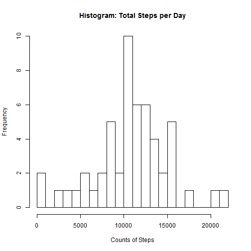
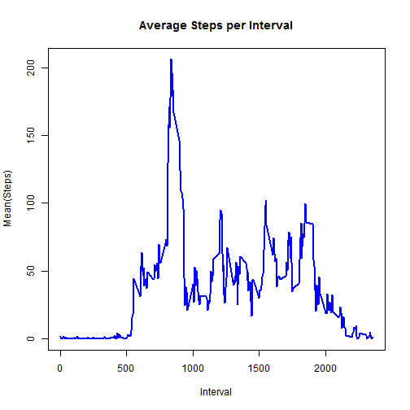
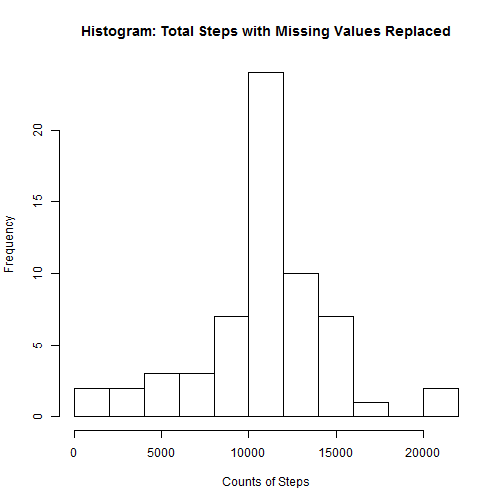

<h1>
<a id="user-content-Reproducible-Research-Peer-Assessment-1" class="anchor" href="#Reproducible-Research-Peer-Assessment-1" aria-hidden="true"><span class="octicon octicon-link"></span></a>Reproducible Research Peer Assessment 1</h1>

The following loads needed data and creates a data frame without NA values


```r
activity <- read.csv("activity.csv")
activ_no_na <- subset(activity,!is.na(activity[,1]))
```


<h2>
<a id="user-content-what-is-mean-total-number-of-steps-taken-per-day" class="anchor" href="#what-is-mean-total-number-of-steps-taken-per-day" aria-hidden="true"><span class="octicon octicon-link"></span></a>What is mean total number of steps taken per day?</h2>


This sums the steps by day using dplyr


```r
library(dplyr)
sumstep <- summarise(group_by(activ_no_na,date),sum(steps, na.rm = TRUE))
names(sumstep) <- c("Date", "Steps")
```


A Histogram of total steps by day


```r
hist(as.matrix(sumstep[,2]), breaks = 30, xlab = "Counts of Steps",main = "Histogram: Total Steps per Day")
```




This calculates the mean and median steps per day


```r
mean <- mean(sumstep$Steps)
median <- median(sumstep$Steps)
```


The mean steps per day is 1.0766189 &times; 10<sup>4</sup>

The median steps per day is 10765


<h2>
<a id="user-content-what-is-the-average-daily-activity-pattern" class="anchor" href="#what-is-the-average-daily-activity-pattern" aria-hidden="true"><span class="octicon octicon-link"></span></a>What is the average daily activity pattern?</h2>


This code calculates the mean by time interval and plots it on a time series graph


```r
meanint <- summarise(group_by(activ_no_na,interval),round(mean(steps),2))

plot(meanint, type = "l", col = "blue", lwd = 2, xlab = "Interval", ylab = "Mean(Steps)", main = "Average Steps per Interval")
```




```r
t <- paste("The maximum average steps occurs in interval", meanint[which(meanint[,2] == max(meanint[,2])),1])
print(t)
```

```
## [1] "The maximum average steps occurs in interval 835"
```


<h2>
<a id="user-content-imputing-missing-values" class="anchor" href="#imputing-missing-values" aria-hidden="true"><span class="octicon octicon-link"></span></a>Imputing missing values</h2>


```r
nas <- sum(is.na(activity))
```


There are a total of 2304 rows with missing values in the original data set


The following is code that fills in the missing values.  It separates the rows with missing values from the complete rows, replaces the NA values with the mean values for each interval from the table above, then recombines and sorts the two sets of data.


```r
activ_na <- merge(activity[is.na(activity),],meanint, by = "interval")[,c(4,3,1)]
names(activ_na) <- names(activity) ##update names to facilitate rbind
activ_na_replaced <- arrange(rbind(activ_no_na,activ_na),date,interval)
```


This section recreates the table above using the missing data and creates a histogram from it.


```r
sumstep_rep <- summarise(group_by(activ_na_replaced,date),sum(steps))
names(sumstep_rep) <- c("Date", "Steps_rep")
hist(as.matrix(sumstep_rep[,2]), breaks = 8, xlab = "Counts of Steps",main = "Histogram: Total Steps with Missing Values Replaced")
```




Now we take the mean and median from the 'replaced' data set and compare to the original


```r
mean_rep <- mean(sumstep_rep$Steps_rep)
median_rep <- median(sumstep_rep$Steps_rep)
```


The new mean total steps with NA values replaced is 1.0766181 &times; 10<sup>4</sup>

The new median total steps with NA values replaced is 1.076613 &times; 10<sup>4</sup>

The mean with NAs replaced shows a difference of -0.0076956

The median with NAs replaced shows a difference of 1.13

<h2>
<a id="user-content-are-there-differences-in-activity-patterns-between-weekdays-and-weekends" class="anchor" href="#are-there-differences-in-activity-patterns-between-weekdays-and-weekends" aria-hidden="true"><span class="octicon octicon-link"></span></a>Are there differences in activity patterns between weekdays and weekends?</h2>


Using the 'replaced' data set, this code determines if the date is a weekend or weekday (somewhat inelligently)


```r
activ_na_replaced$Day_type <-  weekdays(as.Date(activ_na_replaced[,2]))

activ_na_replaced[,4] <- sapply(activ_na_replaced[,4], switch, 
                  Saturday = 'Weekend', 
                  Sunday = 'Weekend', 
                  Monday = 'Weekday', 
                  Tuesday = 'Weekday',
                  Wednesday = 'Weekday',
                  Thursday = 'Weekday',
                  Friday = 'Weekday')

g <- as.data.frame(tapply(activ_na_replaced$steps,activ_na_replaced[,3:4] ,mean))
g$interval <- rownames(g)

library(ggplot2)
qplot(interval, steps, data = activ_na_replaced, facets = Day_type ~ ., geom = c("line"), xlab = "Interval", ylab = "Number of Steps", main = "Avg Steps by Interval: Weekend v Weekday")
```


The answer is yes, weekdays and weekends look different.  It appears this user likes to sleep in on weekends.


