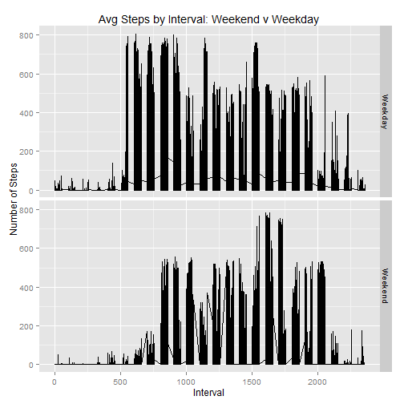

<h1>
<a id="user-content-Reproducible-Research-Peer-Assessment-1" class="anchor" href="#Reproducible-Research-Peer-Assessment-1" aria-hidden="true"><span class="octicon octicon-link"></span></a>Reproducible Research Peer Assessment 1</h1>

The following loads needed data and creates a data frame without NA values


```r
##insert your directory here, I can't get an auto-set to work
setwd("C:/Users/35148/Documents/GitHub/RepData_PeerAssessment1") 
activity <- read.csv("activity.csv")
activ_no_na <- subset(activity,!is.na(activity[,1]))
```


<h2>
<a id="user-content-what-is-mean-total-number-of-steps-taken-per-day" class="anchor" href="#what-is-mean-total-number-of-steps-taken-per-day" aria-hidden="true"><span class="octicon octicon-link"></span></a>What is mean total number of steps taken per day?</h2>


This sums the steps by day using dplyr


```r
library(dplyr)
sumstep <- summarise(group_by(activ_no_na,date),sum(steps))
```


A Histogram of total steps by day


```r
hist(as.matrix(sumstep[,2]), breaks = 8, xlab = "Counts of Steps",main = "Histogram: Total Steps per Day")
```


This calculates the mean and median steps per day


```r
meanmed <- merge(summarise(group_by(activ_no_na,date),round(mean(steps),digits = 2)),
                 summarise(group_by(activ_no_na,date),median(steps)))
names(meanmed) <- c("Date","Mean Steps","Median Steps")
```


And here are the results in table format


```r
library(knitr)
kable(meanmed, format = "html")
```

<table>
 <thead>
  <tr>
   <th style="text-align:left;"> Date </th>
   <th style="text-align:right;"> Mean Steps </th>
   <th style="text-align:right;"> Median Steps </th>
  </tr>
 </thead>
<tbody>
  <tr>
   <td style="text-align:left;"> 2012-10-02 </td>
   <td style="text-align:right;"> 0.44 </td>
   <td style="text-align:right;"> 0 </td>
  </tr>
  <tr>
   <td style="text-align:left;"> 2012-10-03 </td>
   <td style="text-align:right;"> 39.42 </td>
   <td style="text-align:right;"> 0 </td>
  </tr>
  <tr>
   <td style="text-align:left;"> 2012-10-04 </td>
   <td style="text-align:right;"> 42.07 </td>
   <td style="text-align:right;"> 0 </td>
  </tr>
  <tr>
   <td style="text-align:left;"> 2012-10-05 </td>
   <td style="text-align:right;"> 46.16 </td>
   <td style="text-align:right;"> 0 </td>
  </tr>
  <tr>
   <td style="text-align:left;"> 2012-10-06 </td>
   <td style="text-align:right;"> 53.54 </td>
   <td style="text-align:right;"> 0 </td>
  </tr>
  <tr>
   <td style="text-align:left;"> 2012-10-07 </td>
   <td style="text-align:right;"> 38.25 </td>
   <td style="text-align:right;"> 0 </td>
  </tr>
  <tr>
   <td style="text-align:left;"> 2012-10-09 </td>
   <td style="text-align:right;"> 44.48 </td>
   <td style="text-align:right;"> 0 </td>
  </tr>
  <tr>
   <td style="text-align:left;"> 2012-10-10 </td>
   <td style="text-align:right;"> 34.38 </td>
   <td style="text-align:right;"> 0 </td>
  </tr>
  <tr>
   <td style="text-align:left;"> 2012-10-11 </td>
   <td style="text-align:right;"> 35.78 </td>
   <td style="text-align:right;"> 0 </td>
  </tr>
  <tr>
   <td style="text-align:left;"> 2012-10-12 </td>
   <td style="text-align:right;"> 60.35 </td>
   <td style="text-align:right;"> 0 </td>
  </tr>
  <tr>
   <td style="text-align:left;"> 2012-10-13 </td>
   <td style="text-align:right;"> 43.15 </td>
   <td style="text-align:right;"> 0 </td>
  </tr>
  <tr>
   <td style="text-align:left;"> 2012-10-14 </td>
   <td style="text-align:right;"> 52.42 </td>
   <td style="text-align:right;"> 0 </td>
  </tr>
  <tr>
   <td style="text-align:left;"> 2012-10-15 </td>
   <td style="text-align:right;"> 35.20 </td>
   <td style="text-align:right;"> 0 </td>
  </tr>
  <tr>
   <td style="text-align:left;"> 2012-10-16 </td>
   <td style="text-align:right;"> 52.38 </td>
   <td style="text-align:right;"> 0 </td>
  </tr>
  <tr>
   <td style="text-align:left;"> 2012-10-17 </td>
   <td style="text-align:right;"> 46.71 </td>
   <td style="text-align:right;"> 0 </td>
  </tr>
  <tr>
   <td style="text-align:left;"> 2012-10-18 </td>
   <td style="text-align:right;"> 34.92 </td>
   <td style="text-align:right;"> 0 </td>
  </tr>
  <tr>
   <td style="text-align:left;"> 2012-10-19 </td>
   <td style="text-align:right;"> 41.07 </td>
   <td style="text-align:right;"> 0 </td>
  </tr>
  <tr>
   <td style="text-align:left;"> 2012-10-20 </td>
   <td style="text-align:right;"> 36.09 </td>
   <td style="text-align:right;"> 0 </td>
  </tr>
  <tr>
   <td style="text-align:left;"> 2012-10-21 </td>
   <td style="text-align:right;"> 30.63 </td>
   <td style="text-align:right;"> 0 </td>
  </tr>
  <tr>
   <td style="text-align:left;"> 2012-10-22 </td>
   <td style="text-align:right;"> 46.74 </td>
   <td style="text-align:right;"> 0 </td>
  </tr>
  <tr>
   <td style="text-align:left;"> 2012-10-23 </td>
   <td style="text-align:right;"> 30.97 </td>
   <td style="text-align:right;"> 0 </td>
  </tr>
  <tr>
   <td style="text-align:left;"> 2012-10-24 </td>
   <td style="text-align:right;"> 29.01 </td>
   <td style="text-align:right;"> 0 </td>
  </tr>
  <tr>
   <td style="text-align:left;"> 2012-10-25 </td>
   <td style="text-align:right;"> 8.65 </td>
   <td style="text-align:right;"> 0 </td>
  </tr>
  <tr>
   <td style="text-align:left;"> 2012-10-26 </td>
   <td style="text-align:right;"> 23.53 </td>
   <td style="text-align:right;"> 0 </td>
  </tr>
  <tr>
   <td style="text-align:left;"> 2012-10-27 </td>
   <td style="text-align:right;"> 35.14 </td>
   <td style="text-align:right;"> 0 </td>
  </tr>
  <tr>
   <td style="text-align:left;"> 2012-10-28 </td>
   <td style="text-align:right;"> 39.78 </td>
   <td style="text-align:right;"> 0 </td>
  </tr>
  <tr>
   <td style="text-align:left;"> 2012-10-29 </td>
   <td style="text-align:right;"> 17.42 </td>
   <td style="text-align:right;"> 0 </td>
  </tr>
  <tr>
   <td style="text-align:left;"> 2012-10-30 </td>
   <td style="text-align:right;"> 34.09 </td>
   <td style="text-align:right;"> 0 </td>
  </tr>
  <tr>
   <td style="text-align:left;"> 2012-10-31 </td>
   <td style="text-align:right;"> 53.52 </td>
   <td style="text-align:right;"> 0 </td>
  </tr>
  <tr>
   <td style="text-align:left;"> 2012-11-02 </td>
   <td style="text-align:right;"> 36.81 </td>
   <td style="text-align:right;"> 0 </td>
  </tr>
  <tr>
   <td style="text-align:left;"> 2012-11-03 </td>
   <td style="text-align:right;"> 36.70 </td>
   <td style="text-align:right;"> 0 </td>
  </tr>
  <tr>
   <td style="text-align:left;"> 2012-11-05 </td>
   <td style="text-align:right;"> 36.25 </td>
   <td style="text-align:right;"> 0 </td>
  </tr>
  <tr>
   <td style="text-align:left;"> 2012-11-06 </td>
   <td style="text-align:right;"> 28.94 </td>
   <td style="text-align:right;"> 0 </td>
  </tr>
  <tr>
   <td style="text-align:left;"> 2012-11-07 </td>
   <td style="text-align:right;"> 44.73 </td>
   <td style="text-align:right;"> 0 </td>
  </tr>
  <tr>
   <td style="text-align:left;"> 2012-11-08 </td>
   <td style="text-align:right;"> 11.18 </td>
   <td style="text-align:right;"> 0 </td>
  </tr>
  <tr>
   <td style="text-align:left;"> 2012-11-11 </td>
   <td style="text-align:right;"> 43.78 </td>
   <td style="text-align:right;"> 0 </td>
  </tr>
  <tr>
   <td style="text-align:left;"> 2012-11-12 </td>
   <td style="text-align:right;"> 37.38 </td>
   <td style="text-align:right;"> 0 </td>
  </tr>
  <tr>
   <td style="text-align:left;"> 2012-11-13 </td>
   <td style="text-align:right;"> 25.47 </td>
   <td style="text-align:right;"> 0 </td>
  </tr>
  <tr>
   <td style="text-align:left;"> 2012-11-15 </td>
   <td style="text-align:right;"> 0.14 </td>
   <td style="text-align:right;"> 0 </td>
  </tr>
  <tr>
   <td style="text-align:left;"> 2012-11-16 </td>
   <td style="text-align:right;"> 18.89 </td>
   <td style="text-align:right;"> 0 </td>
  </tr>
  <tr>
   <td style="text-align:left;"> 2012-11-17 </td>
   <td style="text-align:right;"> 49.79 </td>
   <td style="text-align:right;"> 0 </td>
  </tr>
  <tr>
   <td style="text-align:left;"> 2012-11-18 </td>
   <td style="text-align:right;"> 52.47 </td>
   <td style="text-align:right;"> 0 </td>
  </tr>
  <tr>
   <td style="text-align:left;"> 2012-11-19 </td>
   <td style="text-align:right;"> 30.70 </td>
   <td style="text-align:right;"> 0 </td>
  </tr>
  <tr>
   <td style="text-align:left;"> 2012-11-20 </td>
   <td style="text-align:right;"> 15.53 </td>
   <td style="text-align:right;"> 0 </td>
  </tr>
  <tr>
   <td style="text-align:left;"> 2012-11-21 </td>
   <td style="text-align:right;"> 44.40 </td>
   <td style="text-align:right;"> 0 </td>
  </tr>
  <tr>
   <td style="text-align:left;"> 2012-11-22 </td>
   <td style="text-align:right;"> 70.93 </td>
   <td style="text-align:right;"> 0 </td>
  </tr>
  <tr>
   <td style="text-align:left;"> 2012-11-23 </td>
   <td style="text-align:right;"> 73.59 </td>
   <td style="text-align:right;"> 0 </td>
  </tr>
  <tr>
   <td style="text-align:left;"> 2012-11-24 </td>
   <td style="text-align:right;"> 50.27 </td>
   <td style="text-align:right;"> 0 </td>
  </tr>
  <tr>
   <td style="text-align:left;"> 2012-11-25 </td>
   <td style="text-align:right;"> 41.09 </td>
   <td style="text-align:right;"> 0 </td>
  </tr>
  <tr>
   <td style="text-align:left;"> 2012-11-26 </td>
   <td style="text-align:right;"> 38.76 </td>
   <td style="text-align:right;"> 0 </td>
  </tr>
  <tr>
   <td style="text-align:left;"> 2012-11-27 </td>
   <td style="text-align:right;"> 47.38 </td>
   <td style="text-align:right;"> 0 </td>
  </tr>
  <tr>
   <td style="text-align:left;"> 2012-11-28 </td>
   <td style="text-align:right;"> 35.36 </td>
   <td style="text-align:right;"> 0 </td>
  </tr>
  <tr>
   <td style="text-align:left;"> 2012-11-29 </td>
   <td style="text-align:right;"> 24.47 </td>
   <td style="text-align:right;"> 0 </td>
  </tr>
</tbody>
</table>


Yes, those are supposed to be all zeros in the Median Steps column.


<h2>
<a id="user-content-what-is-the-average-daily-activity-pattern" class="anchor" href="#what-is-the-average-daily-activity-pattern" aria-hidden="true"><span class="octicon octicon-link"></span></a>What is the average daily activity pattern?</h2>


This code calculates the mean by time interval and plots it on a time series graph


```r
meanint <- summarise(group_by(activ_no_na,interval),round(mean(steps),2))

plot(meanint, type = "l", col = "blue", lwd = 2, xlab = "Interval", ylab = "Mean(Steps)", main = "Average Steps per Interval")
```


```r
t <- paste("The maximum average steps occurs in interval", meanint[which(meanint[,2] == max(meanint[,2])),1])
print(t)
```

```
## [1] "The maximum average steps occurs in interval 835"
```


<h2>
<a id="user-content-imputing-missing-values" class="anchor" href="#imputing-missing-values" aria-hidden="true"><span class="octicon octicon-link"></span></a>Imputing missing values</h2>


```r
nas <- sum(is.na(activity))
```


There are a total of 2304 rows with missing values in the original data set


The following is code that fills in the missing values.  It separates the rows with missing values from the complete rows, replaces the NA values with the mean values for each interval from the table above, then recombines and sorts the two sets of data.


```r
activ_na <- merge(activity[is.na(activity),],meanint, by = "interval")[,c(4,3,1)]
names(activ_na) <- names(activity) ##update names to facilitate rbind
activ_na_replaced <- arrange(rbind(activ_no_na,activ_na),date,interval)
```


This section recreates the table above using the missing data and creates a histogram from it.


```r
sumstep_rep <- summarise(group_by(activ_na_replaced,date),sum(steps))
hist(as.matrix(sumstep_rep[,2]), breaks = 8, xlab = "Counts of Steps",main = "Histogram: Total Steps with Missing Values Replaced")
```


Now we take the mean and median from the 'replaced' data set and compare to the original


```r
meanmed_rep <- cbind(summarise(group_by(activ_na_replaced,date),round(mean(steps),digits = 2)),
                 summarise(group_by(activ_na_replaced,date),median(steps))[,2])
names(meanmed_rep) <- c("Date","Mean Steps Rep","Median Steps Rep")

meanmed_compared <- merge(meanmed,meanmed_rep,by = "Date", all.y = TRUE)
kable(meanmed_compared, format = "html")
```

<table>
 <thead>
  <tr>
   <th style="text-align:left;"> Date </th>
   <th style="text-align:right;"> Mean Steps </th>
   <th style="text-align:right;"> Median Steps </th>
   <th style="text-align:right;"> Mean Steps Rep </th>
   <th style="text-align:right;"> Median Steps Rep </th>
  </tr>
 </thead>
<tbody>
  <tr>
   <td style="text-align:left;"> 2012-10-01 </td>
   <td style="text-align:right;"> NA </td>
   <td style="text-align:right;"> NA </td>
   <td style="text-align:right;"> 37.38 </td>
   <td style="text-align:right;"> 34.115 </td>
  </tr>
  <tr>
   <td style="text-align:left;"> 2012-10-02 </td>
   <td style="text-align:right;"> 0.44 </td>
   <td style="text-align:right;"> 0 </td>
   <td style="text-align:right;"> 0.44 </td>
   <td style="text-align:right;"> 0.000 </td>
  </tr>
  <tr>
   <td style="text-align:left;"> 2012-10-03 </td>
   <td style="text-align:right;"> 39.42 </td>
   <td style="text-align:right;"> 0 </td>
   <td style="text-align:right;"> 39.42 </td>
   <td style="text-align:right;"> 0.000 </td>
  </tr>
  <tr>
   <td style="text-align:left;"> 2012-10-04 </td>
   <td style="text-align:right;"> 42.07 </td>
   <td style="text-align:right;"> 0 </td>
   <td style="text-align:right;"> 42.07 </td>
   <td style="text-align:right;"> 0.000 </td>
  </tr>
  <tr>
   <td style="text-align:left;"> 2012-10-05 </td>
   <td style="text-align:right;"> 46.16 </td>
   <td style="text-align:right;"> 0 </td>
   <td style="text-align:right;"> 46.16 </td>
   <td style="text-align:right;"> 0.000 </td>
  </tr>
  <tr>
   <td style="text-align:left;"> 2012-10-06 </td>
   <td style="text-align:right;"> 53.54 </td>
   <td style="text-align:right;"> 0 </td>
   <td style="text-align:right;"> 53.54 </td>
   <td style="text-align:right;"> 0.000 </td>
  </tr>
  <tr>
   <td style="text-align:left;"> 2012-10-07 </td>
   <td style="text-align:right;"> 38.25 </td>
   <td style="text-align:right;"> 0 </td>
   <td style="text-align:right;"> 38.25 </td>
   <td style="text-align:right;"> 0.000 </td>
  </tr>
  <tr>
   <td style="text-align:left;"> 2012-10-08 </td>
   <td style="text-align:right;"> NA </td>
   <td style="text-align:right;"> NA </td>
   <td style="text-align:right;"> 37.38 </td>
   <td style="text-align:right;"> 34.115 </td>
  </tr>
  <tr>
   <td style="text-align:left;"> 2012-10-09 </td>
   <td style="text-align:right;"> 44.48 </td>
   <td style="text-align:right;"> 0 </td>
   <td style="text-align:right;"> 44.48 </td>
   <td style="text-align:right;"> 0.000 </td>
  </tr>
  <tr>
   <td style="text-align:left;"> 2012-10-10 </td>
   <td style="text-align:right;"> 34.38 </td>
   <td style="text-align:right;"> 0 </td>
   <td style="text-align:right;"> 34.38 </td>
   <td style="text-align:right;"> 0.000 </td>
  </tr>
  <tr>
   <td style="text-align:left;"> 2012-10-11 </td>
   <td style="text-align:right;"> 35.78 </td>
   <td style="text-align:right;"> 0 </td>
   <td style="text-align:right;"> 35.78 </td>
   <td style="text-align:right;"> 0.000 </td>
  </tr>
  <tr>
   <td style="text-align:left;"> 2012-10-12 </td>
   <td style="text-align:right;"> 60.35 </td>
   <td style="text-align:right;"> 0 </td>
   <td style="text-align:right;"> 60.35 </td>
   <td style="text-align:right;"> 0.000 </td>
  </tr>
  <tr>
   <td style="text-align:left;"> 2012-10-13 </td>
   <td style="text-align:right;"> 43.15 </td>
   <td style="text-align:right;"> 0 </td>
   <td style="text-align:right;"> 43.15 </td>
   <td style="text-align:right;"> 0.000 </td>
  </tr>
  <tr>
   <td style="text-align:left;"> 2012-10-14 </td>
   <td style="text-align:right;"> 52.42 </td>
   <td style="text-align:right;"> 0 </td>
   <td style="text-align:right;"> 52.42 </td>
   <td style="text-align:right;"> 0.000 </td>
  </tr>
  <tr>
   <td style="text-align:left;"> 2012-10-15 </td>
   <td style="text-align:right;"> 35.20 </td>
   <td style="text-align:right;"> 0 </td>
   <td style="text-align:right;"> 35.20 </td>
   <td style="text-align:right;"> 0.000 </td>
  </tr>
  <tr>
   <td style="text-align:left;"> 2012-10-16 </td>
   <td style="text-align:right;"> 52.38 </td>
   <td style="text-align:right;"> 0 </td>
   <td style="text-align:right;"> 52.38 </td>
   <td style="text-align:right;"> 0.000 </td>
  </tr>
  <tr>
   <td style="text-align:left;"> 2012-10-17 </td>
   <td style="text-align:right;"> 46.71 </td>
   <td style="text-align:right;"> 0 </td>
   <td style="text-align:right;"> 46.71 </td>
   <td style="text-align:right;"> 0.000 </td>
  </tr>
  <tr>
   <td style="text-align:left;"> 2012-10-18 </td>
   <td style="text-align:right;"> 34.92 </td>
   <td style="text-align:right;"> 0 </td>
   <td style="text-align:right;"> 34.92 </td>
   <td style="text-align:right;"> 0.000 </td>
  </tr>
  <tr>
   <td style="text-align:left;"> 2012-10-19 </td>
   <td style="text-align:right;"> 41.07 </td>
   <td style="text-align:right;"> 0 </td>
   <td style="text-align:right;"> 41.07 </td>
   <td style="text-align:right;"> 0.000 </td>
  </tr>
  <tr>
   <td style="text-align:left;"> 2012-10-20 </td>
   <td style="text-align:right;"> 36.09 </td>
   <td style="text-align:right;"> 0 </td>
   <td style="text-align:right;"> 36.09 </td>
   <td style="text-align:right;"> 0.000 </td>
  </tr>
  <tr>
   <td style="text-align:left;"> 2012-10-21 </td>
   <td style="text-align:right;"> 30.63 </td>
   <td style="text-align:right;"> 0 </td>
   <td style="text-align:right;"> 30.63 </td>
   <td style="text-align:right;"> 0.000 </td>
  </tr>
  <tr>
   <td style="text-align:left;"> 2012-10-22 </td>
   <td style="text-align:right;"> 46.74 </td>
   <td style="text-align:right;"> 0 </td>
   <td style="text-align:right;"> 46.74 </td>
   <td style="text-align:right;"> 0.000 </td>
  </tr>
  <tr>
   <td style="text-align:left;"> 2012-10-23 </td>
   <td style="text-align:right;"> 30.97 </td>
   <td style="text-align:right;"> 0 </td>
   <td style="text-align:right;"> 30.97 </td>
   <td style="text-align:right;"> 0.000 </td>
  </tr>
  <tr>
   <td style="text-align:left;"> 2012-10-24 </td>
   <td style="text-align:right;"> 29.01 </td>
   <td style="text-align:right;"> 0 </td>
   <td style="text-align:right;"> 29.01 </td>
   <td style="text-align:right;"> 0.000 </td>
  </tr>
  <tr>
   <td style="text-align:left;"> 2012-10-25 </td>
   <td style="text-align:right;"> 8.65 </td>
   <td style="text-align:right;"> 0 </td>
   <td style="text-align:right;"> 8.65 </td>
   <td style="text-align:right;"> 0.000 </td>
  </tr>
  <tr>
   <td style="text-align:left;"> 2012-10-26 </td>
   <td style="text-align:right;"> 23.53 </td>
   <td style="text-align:right;"> 0 </td>
   <td style="text-align:right;"> 23.53 </td>
   <td style="text-align:right;"> 0.000 </td>
  </tr>
  <tr>
   <td style="text-align:left;"> 2012-10-27 </td>
   <td style="text-align:right;"> 35.14 </td>
   <td style="text-align:right;"> 0 </td>
   <td style="text-align:right;"> 35.14 </td>
   <td style="text-align:right;"> 0.000 </td>
  </tr>
  <tr>
   <td style="text-align:left;"> 2012-10-28 </td>
   <td style="text-align:right;"> 39.78 </td>
   <td style="text-align:right;"> 0 </td>
   <td style="text-align:right;"> 39.78 </td>
   <td style="text-align:right;"> 0.000 </td>
  </tr>
  <tr>
   <td style="text-align:left;"> 2012-10-29 </td>
   <td style="text-align:right;"> 17.42 </td>
   <td style="text-align:right;"> 0 </td>
   <td style="text-align:right;"> 17.42 </td>
   <td style="text-align:right;"> 0.000 </td>
  </tr>
  <tr>
   <td style="text-align:left;"> 2012-10-30 </td>
   <td style="text-align:right;"> 34.09 </td>
   <td style="text-align:right;"> 0 </td>
   <td style="text-align:right;"> 34.09 </td>
   <td style="text-align:right;"> 0.000 </td>
  </tr>
  <tr>
   <td style="text-align:left;"> 2012-10-31 </td>
   <td style="text-align:right;"> 53.52 </td>
   <td style="text-align:right;"> 0 </td>
   <td style="text-align:right;"> 53.52 </td>
   <td style="text-align:right;"> 0.000 </td>
  </tr>
  <tr>
   <td style="text-align:left;"> 2012-11-01 </td>
   <td style="text-align:right;"> NA </td>
   <td style="text-align:right;"> NA </td>
   <td style="text-align:right;"> 37.38 </td>
   <td style="text-align:right;"> 34.115 </td>
  </tr>
  <tr>
   <td style="text-align:left;"> 2012-11-02 </td>
   <td style="text-align:right;"> 36.81 </td>
   <td style="text-align:right;"> 0 </td>
   <td style="text-align:right;"> 36.81 </td>
   <td style="text-align:right;"> 0.000 </td>
  </tr>
  <tr>
   <td style="text-align:left;"> 2012-11-03 </td>
   <td style="text-align:right;"> 36.70 </td>
   <td style="text-align:right;"> 0 </td>
   <td style="text-align:right;"> 36.70 </td>
   <td style="text-align:right;"> 0.000 </td>
  </tr>
  <tr>
   <td style="text-align:left;"> 2012-11-04 </td>
   <td style="text-align:right;"> NA </td>
   <td style="text-align:right;"> NA </td>
   <td style="text-align:right;"> 37.38 </td>
   <td style="text-align:right;"> 34.115 </td>
  </tr>
  <tr>
   <td style="text-align:left;"> 2012-11-05 </td>
   <td style="text-align:right;"> 36.25 </td>
   <td style="text-align:right;"> 0 </td>
   <td style="text-align:right;"> 36.25 </td>
   <td style="text-align:right;"> 0.000 </td>
  </tr>
  <tr>
   <td style="text-align:left;"> 2012-11-06 </td>
   <td style="text-align:right;"> 28.94 </td>
   <td style="text-align:right;"> 0 </td>
   <td style="text-align:right;"> 28.94 </td>
   <td style="text-align:right;"> 0.000 </td>
  </tr>
  <tr>
   <td style="text-align:left;"> 2012-11-07 </td>
   <td style="text-align:right;"> 44.73 </td>
   <td style="text-align:right;"> 0 </td>
   <td style="text-align:right;"> 44.73 </td>
   <td style="text-align:right;"> 0.000 </td>
  </tr>
  <tr>
   <td style="text-align:left;"> 2012-11-08 </td>
   <td style="text-align:right;"> 11.18 </td>
   <td style="text-align:right;"> 0 </td>
   <td style="text-align:right;"> 11.18 </td>
   <td style="text-align:right;"> 0.000 </td>
  </tr>
  <tr>
   <td style="text-align:left;"> 2012-11-09 </td>
   <td style="text-align:right;"> NA </td>
   <td style="text-align:right;"> NA </td>
   <td style="text-align:right;"> 37.38 </td>
   <td style="text-align:right;"> 34.115 </td>
  </tr>
  <tr>
   <td style="text-align:left;"> 2012-11-10 </td>
   <td style="text-align:right;"> NA </td>
   <td style="text-align:right;"> NA </td>
   <td style="text-align:right;"> 37.38 </td>
   <td style="text-align:right;"> 34.115 </td>
  </tr>
  <tr>
   <td style="text-align:left;"> 2012-11-11 </td>
   <td style="text-align:right;"> 43.78 </td>
   <td style="text-align:right;"> 0 </td>
   <td style="text-align:right;"> 43.78 </td>
   <td style="text-align:right;"> 0.000 </td>
  </tr>
  <tr>
   <td style="text-align:left;"> 2012-11-12 </td>
   <td style="text-align:right;"> 37.38 </td>
   <td style="text-align:right;"> 0 </td>
   <td style="text-align:right;"> 37.38 </td>
   <td style="text-align:right;"> 0.000 </td>
  </tr>
  <tr>
   <td style="text-align:left;"> 2012-11-13 </td>
   <td style="text-align:right;"> 25.47 </td>
   <td style="text-align:right;"> 0 </td>
   <td style="text-align:right;"> 25.47 </td>
   <td style="text-align:right;"> 0.000 </td>
  </tr>
  <tr>
   <td style="text-align:left;"> 2012-11-14 </td>
   <td style="text-align:right;"> NA </td>
   <td style="text-align:right;"> NA </td>
   <td style="text-align:right;"> 37.38 </td>
   <td style="text-align:right;"> 34.115 </td>
  </tr>
  <tr>
   <td style="text-align:left;"> 2012-11-15 </td>
   <td style="text-align:right;"> 0.14 </td>
   <td style="text-align:right;"> 0 </td>
   <td style="text-align:right;"> 0.14 </td>
   <td style="text-align:right;"> 0.000 </td>
  </tr>
  <tr>
   <td style="text-align:left;"> 2012-11-16 </td>
   <td style="text-align:right;"> 18.89 </td>
   <td style="text-align:right;"> 0 </td>
   <td style="text-align:right;"> 18.89 </td>
   <td style="text-align:right;"> 0.000 </td>
  </tr>
  <tr>
   <td style="text-align:left;"> 2012-11-17 </td>
   <td style="text-align:right;"> 49.79 </td>
   <td style="text-align:right;"> 0 </td>
   <td style="text-align:right;"> 49.79 </td>
   <td style="text-align:right;"> 0.000 </td>
  </tr>
  <tr>
   <td style="text-align:left;"> 2012-11-18 </td>
   <td style="text-align:right;"> 52.47 </td>
   <td style="text-align:right;"> 0 </td>
   <td style="text-align:right;"> 52.47 </td>
   <td style="text-align:right;"> 0.000 </td>
  </tr>
  <tr>
   <td style="text-align:left;"> 2012-11-19 </td>
   <td style="text-align:right;"> 30.70 </td>
   <td style="text-align:right;"> 0 </td>
   <td style="text-align:right;"> 30.70 </td>
   <td style="text-align:right;"> 0.000 </td>
  </tr>
  <tr>
   <td style="text-align:left;"> 2012-11-20 </td>
   <td style="text-align:right;"> 15.53 </td>
   <td style="text-align:right;"> 0 </td>
   <td style="text-align:right;"> 15.53 </td>
   <td style="text-align:right;"> 0.000 </td>
  </tr>
  <tr>
   <td style="text-align:left;"> 2012-11-21 </td>
   <td style="text-align:right;"> 44.40 </td>
   <td style="text-align:right;"> 0 </td>
   <td style="text-align:right;"> 44.40 </td>
   <td style="text-align:right;"> 0.000 </td>
  </tr>
  <tr>
   <td style="text-align:left;"> 2012-11-22 </td>
   <td style="text-align:right;"> 70.93 </td>
   <td style="text-align:right;"> 0 </td>
   <td style="text-align:right;"> 70.93 </td>
   <td style="text-align:right;"> 0.000 </td>
  </tr>
  <tr>
   <td style="text-align:left;"> 2012-11-23 </td>
   <td style="text-align:right;"> 73.59 </td>
   <td style="text-align:right;"> 0 </td>
   <td style="text-align:right;"> 73.59 </td>
   <td style="text-align:right;"> 0.000 </td>
  </tr>
  <tr>
   <td style="text-align:left;"> 2012-11-24 </td>
   <td style="text-align:right;"> 50.27 </td>
   <td style="text-align:right;"> 0 </td>
   <td style="text-align:right;"> 50.27 </td>
   <td style="text-align:right;"> 0.000 </td>
  </tr>
  <tr>
   <td style="text-align:left;"> 2012-11-25 </td>
   <td style="text-align:right;"> 41.09 </td>
   <td style="text-align:right;"> 0 </td>
   <td style="text-align:right;"> 41.09 </td>
   <td style="text-align:right;"> 0.000 </td>
  </tr>
  <tr>
   <td style="text-align:left;"> 2012-11-26 </td>
   <td style="text-align:right;"> 38.76 </td>
   <td style="text-align:right;"> 0 </td>
   <td style="text-align:right;"> 38.76 </td>
   <td style="text-align:right;"> 0.000 </td>
  </tr>
  <tr>
   <td style="text-align:left;"> 2012-11-27 </td>
   <td style="text-align:right;"> 47.38 </td>
   <td style="text-align:right;"> 0 </td>
   <td style="text-align:right;"> 47.38 </td>
   <td style="text-align:right;"> 0.000 </td>
  </tr>
  <tr>
   <td style="text-align:left;"> 2012-11-28 </td>
   <td style="text-align:right;"> 35.36 </td>
   <td style="text-align:right;"> 0 </td>
   <td style="text-align:right;"> 35.36 </td>
   <td style="text-align:right;"> 0.000 </td>
  </tr>
  <tr>
   <td style="text-align:left;"> 2012-11-29 </td>
   <td style="text-align:right;"> 24.47 </td>
   <td style="text-align:right;"> 0 </td>
   <td style="text-align:right;"> 24.47 </td>
   <td style="text-align:right;"> 0.000 </td>
  </tr>
  <tr>
   <td style="text-align:left;"> 2012-11-30 </td>
   <td style="text-align:right;"> NA </td>
   <td style="text-align:right;"> NA </td>
   <td style="text-align:right;"> 37.38 </td>
   <td style="text-align:right;"> 34.115 </td>
  </tr>
</tbody>
</table>


We see that the missing values were for complete days and that the only difference between data sets is the 'replaced' data set shows values on the missing days.


<h2>
<a id="user-content-are-there-differences-in-activity-patterns-between-weekdays-and-weekends" class="anchor" href="#are-there-differences-in-activity-patterns-between-weekdays-and-weekends" aria-hidden="true"><span class="octicon octicon-link"></span></a>Are there differences in activity patterns between weekdays and weekends?</h2>


Using the 'replaced' data set, this code determines if the date is a weekend or weekday (somewhat inelligently)


```r
activ_na_replaced$Day_type <-  weekdays(as.Date(activ_na_replaced[,2]))

activ_na_replaced[,4] <- sapply(activ_na_replaced[,4], switch, 
                  Saturday = 'Weekend', 
                  Sunday = 'Weekend', 
                  Monday = 'Weekday', 
                  Tuesday = 'Weekday',
                  Wednesday = 'Weekday',
                  Thursday = 'Weekday',
                  Friday = 'Weekday')

g <- as.data.frame(tapply(activ_na_replaced$steps,activ_na_replaced[,3:4] ,mean))
g$interval <- rownames(g)

library(ggplot2)
qplot(interval, steps, data = activ_na_replaced, facets = Day_type ~ ., geom = c("line"), xlab = "Interval", ylab = "Number of Steps", main = "Avg Steps by Interval: Weekend v Weekday")
```




The answer is yes, weekdays and weekends look different.  It appears this user likes to sleep in on weekends.


